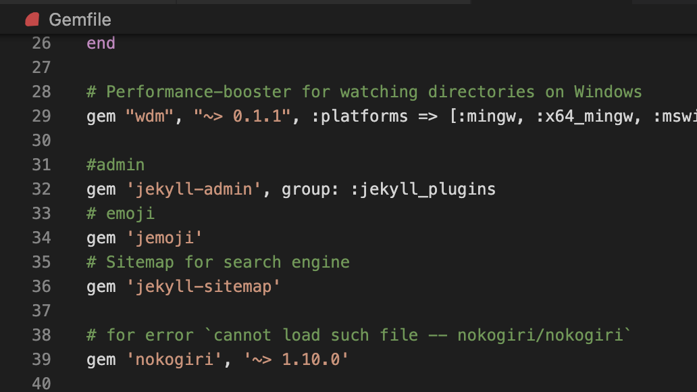

## 문제

Github page를 만들기 위해서 소스를 다운받고 빌드를 했다.
```bash
    $ bundle exec jekyll serve
```
빌드중 오류가 발생했고 그 내용은 아래와 같다   
> `cannot load such file -- nokogiri/nokogiri`

 

## 해결방법

nokogiri라는 모듈의 버전을 다운그레이드 해주니 해결됐다.
 

```ruby
    gem 'nokogiri', '~> 1.10.0
```
```bash
    $ bundle update
```


<figcaption>Gemfile에 추가</figcaption>